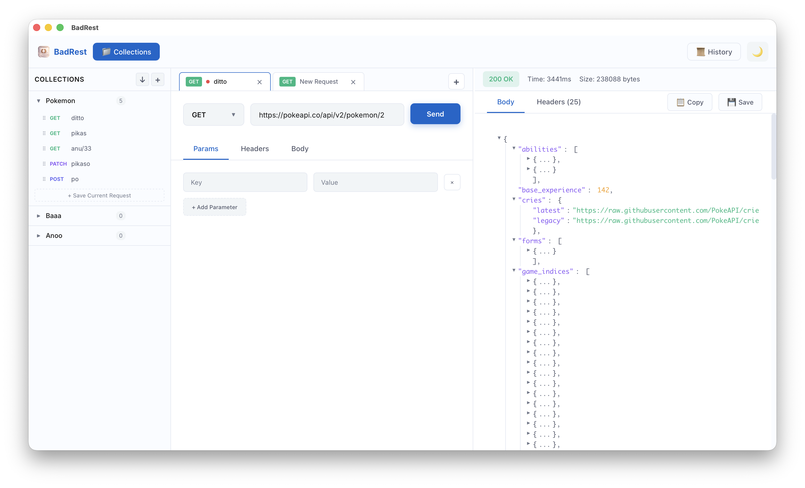

# BadRest

A beautiful, modern, and lightweight REST API Client built with Tauri v2, React, and TypeScript.
Designed to be a fast and efficient alternative to Postman/Insomnia.



## 🚀 Features

### Core Functionality
- **Multi-Tab Interface**: Work on multiple requests simultaneously with isolated state
  - Tab reordering with drag & drop
  - Tab renaming (double-click)
  - Duplicate tabs
  - Close tabs (single, all others, to right)
  - Context menu with right-click
- **Request Builder**: Full HTTP method support
  - GET, POST, PUT, DELETE, PATCH, HEAD, OPTIONS
  - Query Parameters editor
  - Headers editor with key-value pairs
  - Request Body support (None, JSON, Text, Form)
  - URL auto-complete

### Collections & Organization
- **Collections**: Organize and save requests in collections
  - Create, rename, delete collections
  - Drag & drop to reorder collections
  - Collapse/expand collections
  - Collection-level headers (applied to all requests)
  - Collection-level variables with `{{variable}}` substitution
  - Import/export collections as JSON
  - Link tabs to collection requests with auto-save (Cmd+S)
  - Dirty indicator for unsaved changes

### Response Handling
- **Advanced Response Viewer**:
  - Interactive JSON Tree View with expand/collapse
  - Syntax highlighting
  - Copy response to clipboard
  - Save response as JSON file
  - Response headers viewer
  - Status code badges with color coding
  - Response time and size metrics

### Productivity Features
- **Request History**: Automatic history tracking
- **Persistence**: Auto-save tabs, collections, and settings
- **Keyboard Shortcuts**:
  - `Cmd+S` / `Ctrl+S`: Save request to collection
  - `Cmd+T` / `Ctrl+T`: New tab
  - `Enter`: Send request (in URL bar)
- **Theme Support**: Beautiful dark & light modes
- **Resizable Panels**: Adjust request/response panel widths

### Platform
- **Cross-Platform**: Native builds for macOS (Apple Silicon & Intel) and Windows
- **Lightweight**: Fast startup and low memory footprint
- **Native Performance**: Built with Rust backend via Tauri v2

## 🛠️ Tech Stack

- **Core**: [Tauri v2](https://tauri.app/) (Rust)
- **Frontend**: [React v19](https://react.dev/)
- **Build Tool**: [Vite](https://vitejs.dev/)
- **Language**: TypeScript, Rust

## 📦 Installation

Specific installers for your platform can be found in the [Releases](https://github.com/iskaelcom/badrest/releases) page.

## 💻 Development Setup

### Prerequisites

- [Node.js](https://nodejs.org/) (v20+)
- [Rust](https://www.rust-lang.org/tools/install) (latest stable)
- [Tauri CLI](https://tauri.app/v1/guides/getting-started/prerequisites)

### Steps

1.  Clone the repository:
    ```bash
    git clone https://github.com/iskaelcom/badrest.git
    cd badrest
    ```

2.  Install dependencies:
    ```bash
    npm install
    ```

3.  Run in development mode:
    ```bash
    npm run tauri dev
    ```

## 🏗️ Building for Production

### macOS (Local Build)

To build a `.dmg` or `.app` for your current macOS architecture:

```bash
npm run tauri build
```
Artifacts will be in `src-tauri/target/release/bundle/dmg/`.

### Windows & Cross-Platform

Cross-compilation from macOS to Windows is complex. We recommend using the provided **GitHub Actions** workflow.

1.  Push this code to a GitHub repository.
2.  Create a Tag (e.g., `v0.1.0`) and push it:
    ```bash
    git tag v0.1.0
    git push origin v0.1.0
    ```
3.  The workflow in `.github/workflows/release.yml` will automatically:
    -   Build for Windows (`.exe`)
    -   Build for macOS Intel (`.dmg`)
    -   Build for macOS Silicon (`.dmg`)
    -   Create a GitHub Release and upload the assets.

## 📄 License

MIT
