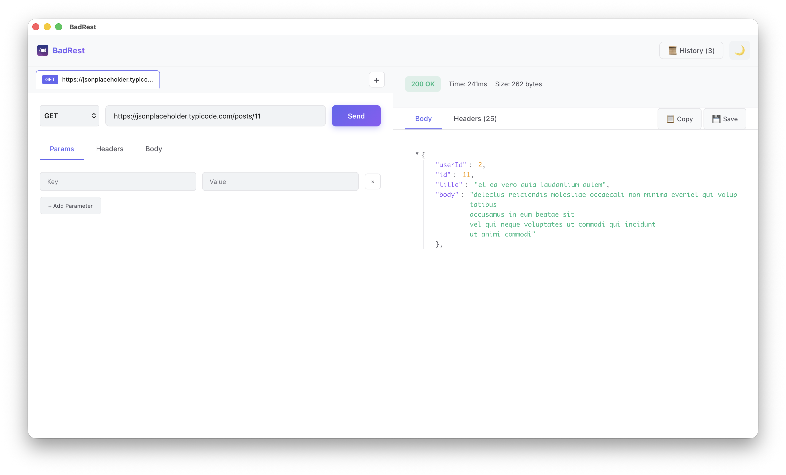

# BadRest

A beautiful, modern, and lightweight REST API Client built with Tauri v2, React, and TypeScript.
Designed to be a fast and efficient alternative to Postman/Insomnia.



## 🚀 Features

- **Multi-Tab Interface**: Work on multiple requests simultaneously with isolated state.
- **Request Builder**: Support for GET, POST, PUT, DELETE, PATCH, and more.
- **Advanced Editors**:
  - Request Headers
  - Query Parameters
  - Request Body (JSON, Text, formatting supported)
- **Response Viewer**:
  - Validated JSON Tree View with Expand/Collapse
  - Syntax Highlighting
  - Response Headers & Status
  - Save Response as JSON file
- **History**: Automatically saves your request history locally.
- **Persistence**: tabs and settings are saved automatically (localStorage).
- **Theming**: Beautiful Dark & Light mode.
- **Cross-Platform**: Built for macOS (Apple Silicon & Intel) and Windows.

## 🛠️ Tech Stack

- **Core**: [Tauri v2](https://tauri.app/) (Rust)
- **Frontend**: [React v19](https://react.dev/)
- **Build Tool**: [Vite](https://vitejs.dev/)
- **Language**: TypeScript, Rust

## 📦 Installation

Specific installers for your platform can be found in the [Releases](https://github.com/iskaelcom/badrest/releases) page.

## 💻 Development Setup

### Prerequisites

- [Node.js](https://nodejs.org/) (v20+)
- [Rust](https://www.rust-lang.org/tools/install) (latest stable)
- [Tauri CLI](https://tauri.app/v1/guides/getting-started/prerequisites)

### Steps

1.  Clone the repository:
    ```bash
    git clone https://github.com/iskaelcom/badrest.git
    cd badrest
    ```

2.  Install dependencies:
    ```bash
    npm install
    ```

3.  Run in development mode:
    ```bash
    npm run tauri dev
    ```

## 🏗️ Building for Production

### macOS (Local Build)

To build a `.dmg` or `.app` for your current macOS architecture:

```bash
npm run tauri build
```
Artifacts will be in `src-tauri/target/release/bundle/dmg/`.

### Windows & Cross-Platform

Cross-compilation from macOS to Windows is complex. We recommend using the provided **GitHub Actions** workflow.

1.  Push this code to a GitHub repository.
2.  Create a Tag (e.g., `v0.1.0`) and push it:
    ```bash
    git tag v0.1.0
    git push origin v0.1.0
    ```
3.  The workflow in `.github/workflows/release.yml` will automatically:
    -   Build for Windows (`.exe`)
    -   Build for macOS Intel (`.dmg`)
    -   Build for macOS Silicon (`.dmg`)
    -   Create a GitHub Release and upload the assets.

## 📄 License

MIT
